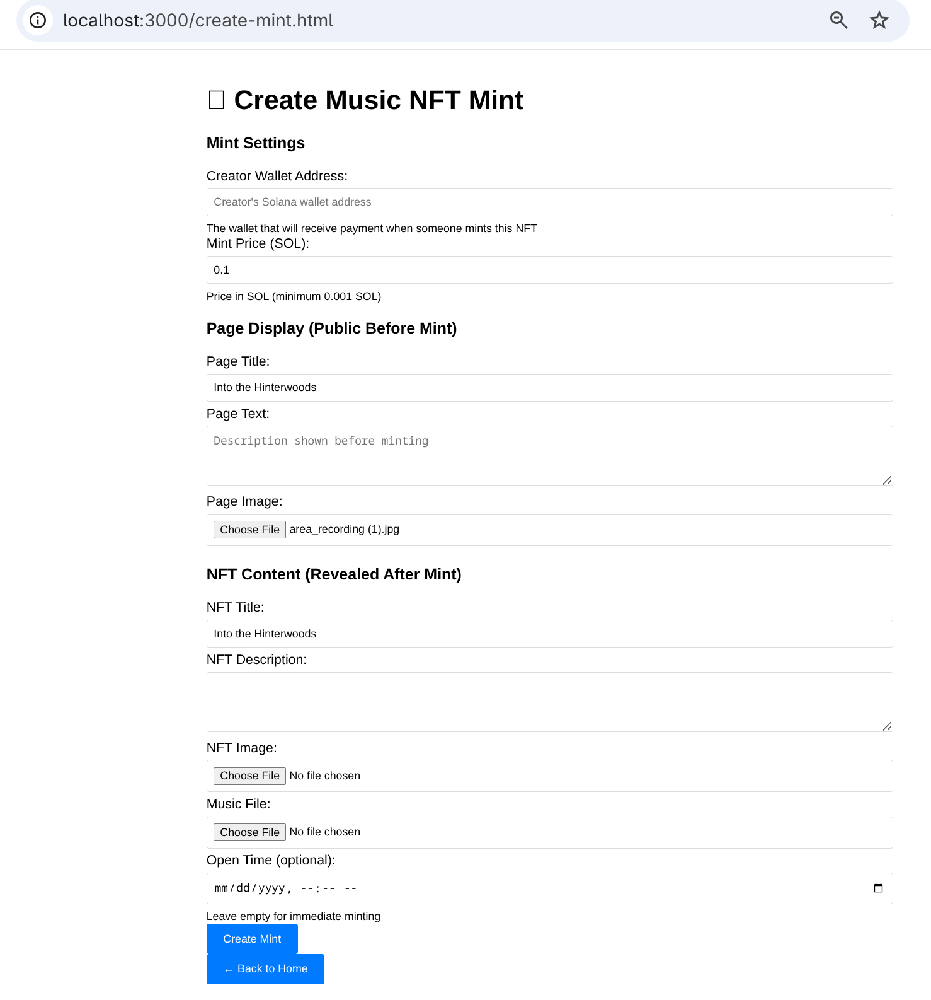
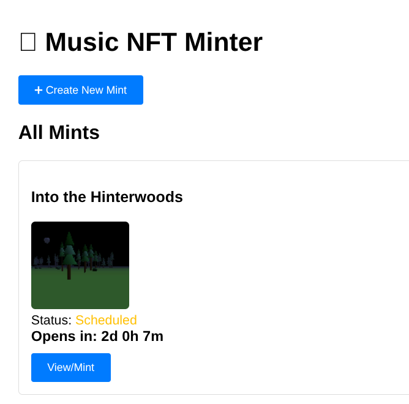
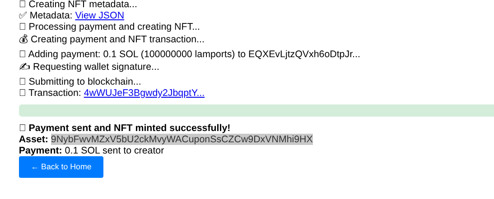
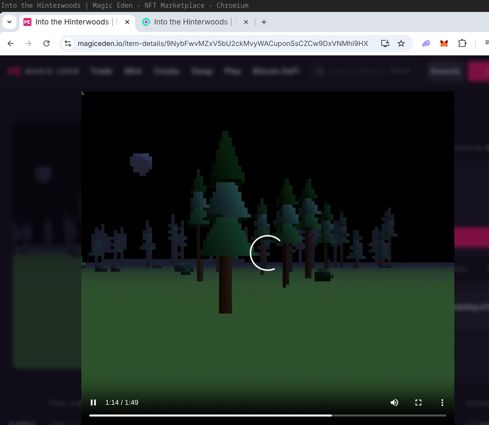

## Music NFT Platform
Website that allows creating Solana NFTs with music content that will show on MagicEden 
(the major Solana NFT marketplace). The website lets the creator set up a mint page with
optional release date/time, a marketing title/description/image and a price. Mints are 
listed on the homepage and once past the release time anyone can mint the NFT, which pays the
creator address and reveals the metadata (a video combined from the audio and a cover image).

